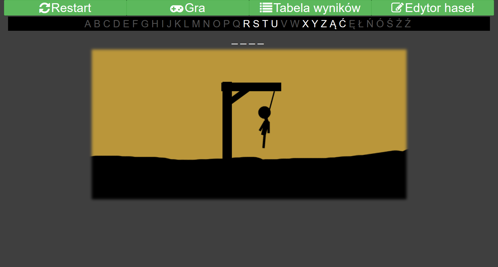
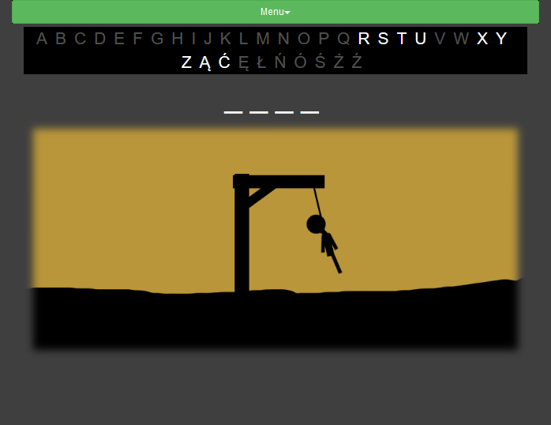

# Hangman
Hangman game has been created in web technology with using asynchronous function calls.
The project has been created with the use of JavaScript, PHP, jQuery, and SQL.
Page with the game has been stylized with use of the bootstrap library. Project is responsive, what able to play even on mobile devices.

Big screen version

Mobile version

## Application features
- inserting own passwords to database (even with polish letters)
- saving score records
- animated movement of hangman character, created with the use of trigonometric functions
- choosing letters by clicking/tapping letters, which are marked after use.

## Configuration
1. Create a database with needed tables.
File with tables is located in the project folder.
For xampp server,  create database with name "wisielec" and  utf8_unicode_ci encoding;
2. Next for database choose import option and choose file "wisielec.sql",
3. After tables import, hangman game is ready to play.

Project has been tested for database user 'root' without a password.
Access data to database can be changed in file "connectDb.php" in folder "scripts".

---
# [PL] Wisielec
Gra wisielec została stworzona w technologii webowej z wykorzystaniem asynchronicznych wywołań funkcji.
Projekt został stworzyny z wykorzystaniem JavaScript, PHP, jQuery oraz SQL.
Strona została ostylowana z użyciem biblioteki bootstrap. Projekt jest responsywny, co umożliwia granie nawet na urządzeniach mobilnych.

Wersja na duży ekran

Wersja mobilna

## Cechy aplikacji
- wprowadzanie własnych haseł do bazy (również z polskimi znakami)
- zapisywanie rekordów
- animacja ruchu postaci wisielca została z użyciem funkcji trygonometrycznych
- wprowadzanie liter odbywa się poprzez kliknięcie odpowiedniej litery, która zostaje odznaczona po jej wykorzystaniu.

## Konfiguracja
1. Utwórz bazę danych z potrzebnymi tabelami.
Plik z tabelami znajduje się w folderze projektu.
Dla serwera xampp należy utworzyć nową bazę o nazwie "wisielec" z kodowaniem utf8_unicode_ci;
2. Następnie dla bazy należy wybrać opcję import i wybrać plik "wisielec.sql",
3. Po zaimportowaniu tabel, gra wisielec jest gotowa do uruchomienia.

Projekt był testowany dla użytkownika bazy danych 'root' bez ustawionego hasła.
Dane dostępu do bazy można zmienić w pliku "connectDb.php" w folderze "scripts".